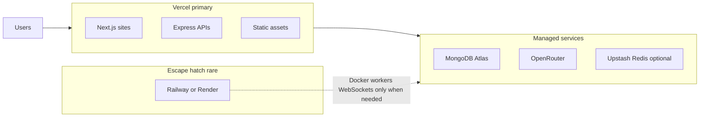

# Fast Dog Coding — Hosting Strategy

Default platform choices for Fast Dog Coding projects. Use **Vercel as the primary web host**; add managed services and a rare secondary host only when serverless cannot fit.

## Architecture

## Where to deploy what

| Workload | Host | Notes |
|----------|------|-------|
| Next.js marketing / app sites | **Vercel** | First-class support; preview deploys, rollback, edge |
| Small Node APIs (Express, etc.) | **Vercel** | Export app from `app.js`; static files in `public/` |
| Static sites / SPAs | **Vercel** | Build output or `public/` |
| Databases | **External** | MongoDB Atlas, Neon, Supabase — not on Vercel |
| LLM / email / payments | **External** | OpenRouter, Resend, Stripe, etc. |
| Rate limiting at scale | **Vercel WAF (Pro)** or **Upstash** | In-memory limits are per serverless instance |
| Docker / long workers / WebSockets | **Railway or Render** | Secondary host for edge cases only |

## Vercel plan guidance

| Plan | When to use |
|------|-------------|
| **Hobby** | Experiments, previews; avoid production LLM chat (short timeouts) |
| **Pro ($20/mo/seat)** | Production sites, chat APIs, custom domains, better logs |

One Pro seat is a reasonable default for a portfolio site, Candidate Concierge, and a few small APIs.

## Standard workflow

1. **One Vercel team** for all Fast Dog Coding web projects.
2. **Git-connected projects** — every push gets a preview URL; merge to main deploys production.
3. **Environment variables** per project in Vercel (Production / Preview / Development).
4. **Naming** — use consistent prefixes where shared: `MONGODB_*`, `OPENROUTER_*`, etc.
5. **Secrets** — never commit `.env`; use `.env.sample` as the template; document in `DEPLOYMENT.md` per app.

## When Vercel is not enough

Use Railway or Render **in addition to** Vercel if a project needs:

- Dockerfile-first deployment without a serverless refactor
- Persistent WebSocket servers
- Long-running background workers beyond Vercel Cron limits
- Large local file processing or persistent disk
- Function bundles over 250 MB or execution beyond plan max duration

For background jobs that still fit serverless, prefer [Inngest](https://www.inngest.com/) or [Trigger.dev](https://trigger.dev/) on Vercel before reaching for a container host.

## Project-specific docs

| Project | Deployment doc |
|---------|----------------|
| Candidate Concierge | [DEPLOYMENT.md](DEPLOYMENT.md) |
| Fast Dog Coding website (Next.js) | Add `DEPLOYMENT.md` when that repo is created |

## Rollout order

1. **Pilot:** Candidate Concierge on Vercel (validates Express + Atlas + OpenRouter).
2. **Primary:** Fast Dog Coding Next.js site on the same Vercel team.
3. **Standardize:** env-var naming, preview deploys, and this checklist for new repos.
4. **Decommission:** legacy hosts (e.g. AWS App Runner) after DNS cutover and soak period.
